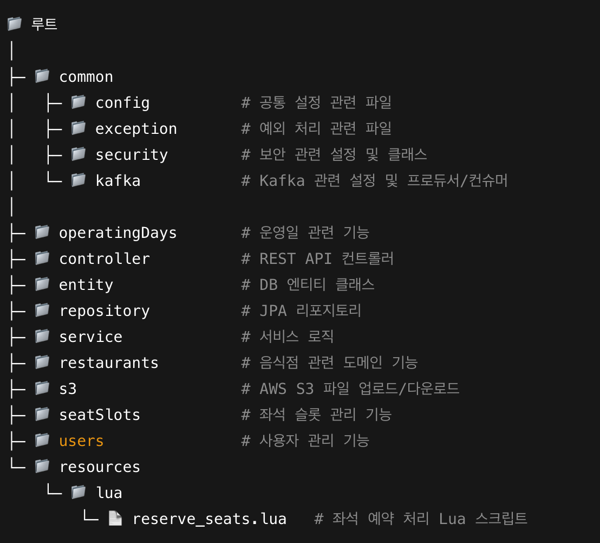
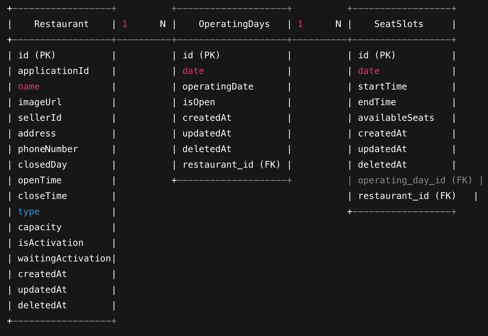
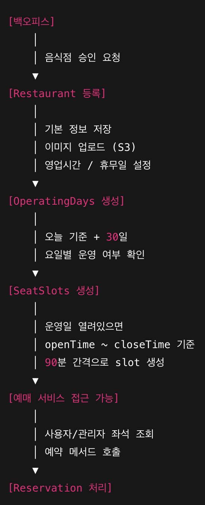

# 다예약 - MSA 기반 멀티 콘텐츠 통합 예매 서비스
## 음식점 서비스 - 'Restaurant'
🍽️ 음식점 운영 정보 및 좌석 관리 시스템 🍽️

  
[홈페이지](https://github.com/Lucky-Bikini-City-4/restaurant-service) | [Notion](https://www.notion.so/teamsparta/restaurant-service)

---

## 목차
- 프로젝트 소개
- 기능 소개
- 기술 스택
- 브랜치 및 디렉토리 구조
- 아키텍처 설계
- 운영일/좌석 관리 플로우
- Lua 좌석 예약 스크립트
- API 명세

---

## 🚩 1. 프로젝트 소개
**MSA 기반 멀티 콘텐츠 통합 예매 서비스 음식점 관리 서비스**

**프로젝트 개발 기간:** 25.09.01 ~ 25.10.03

**목적:** 음식점 등록, 운영일자 관리, 좌석 생성, 예매 서비스 연동

- 음식점 등록 및 승인 관리
- 운영일자 자동 생성 (30일 단위)
- 좌석 생성 및 예약 가능 상태 제공
- 예매 서비스와 실시간 연동

---

## ✨ 2. 기능 소개

### 음식점 관리
- 음식점 기본 정보 등록 및 조회
- 운영 시간, 주소, 연락처 등 정보 관리
- AWS S3를 활용한 이미지 업로드/다운로드

### 운영일자 관리
- 운영일자 30일 단위 자동 생성
- 운영일자 기반 좌석 생성

### 좌석 관리
- 운영 시간 기준 좌석 생성 (90분 간격)
- 예매 서비스에서 좌석 조회 및 예약 가능
- 좌석 예약 Lua 스크립트(`reserve_seats.lua`) 연동

---

## 📚 3. 기술 스택
- **Backend:** Java 17, Spring Boot (JPA, Security, AOP, Kafka, Feign)
- **DB:** MySQL (예약/좌석 처리에 최적화)
- **Infra:** AWS EC2, S3
- **Lua:** 좌석 예약 로직 스크립트

---

## 🗂️ 4. 브랜치 및 디렉토리 구조

### 브랜치
- `main`: 배포용 브랜치
- `dev`: 개발용 브랜치

### 디렉토리 구조

  

---

## ⚙️ 5. 아키텍처 설계
- MSA 기반 서비스 분리 (Backoffice ↔ Restaurant Service ↔ Reservation Service)
- 음식점 승인 이벤트 발생 시 Kafka를 통해 실시간 전달
- 좌석 생성/운영일자 관리 서비스 분리
- Lua 스크립트를 통한 예약 처리 자동화

---

## ✅ 6. 운영일/좌석 관리 플로우

- **승인 요청:** 백오피스에서 음식점 승인 요청
- **음식점 등록:** 음식점 기본 정보 등록
- **운영일자 생성:** 30일 단위 자동 생성
- **좌석 생성:** 운영시간 ~ 마감시간, 90분 단위로 좌석 생성
- **예매서비스 접근:** 예매 서비스에서 좌석 조회 및 예약 가능

---

## 📌 7. 의사결정 및 데이터베이스 선택 근거

## 📌 7. 의사결정 및 데이터베이스 선택 근거

### 1️⃣ Redis + Lua vs Kafka 비교

### 🔹 Redis + Lua vs Kafka 비교

| 구분 | Redis + Lua | Kafka |
|------|------------|-------|
| 동시성 처리 | 분산 락 + Lua 스크립트 → 동시에 여러 요청 발생 시 락으로 원자적 처리 | 이벤트 기반 비동기 처리 → 이벤트 수신 후 나중에 처리, 즉시 반영되지 않음 |
| 처리 성격 | 실시간, 데이터 상태 항상 정확 → 원자적 | 이벤트 처리라 즉시 반영되지 않을 수 있음 → eventual consistency |
| DB 접근 | Redis 내 상태 처리 → DB 접근 최소화, 성능 부담 감소 | 이벤트 수신 후 DB 업데이트 필요 → DB 접근 발생 |
| 장점 | - 상태 변경 원자적 → 충돌 걱정 없음 - 동시 요청 안정적 처리 - DB 부담 감소 | - 서비스 간 결합 느슨 → 유지보수/확장 용이 - 장애 발생 시 재처리 가능 → 안정성 확보 |
| 단점 | - 락 시간 초과 시 정합성 문제 가능 - Redis/Lua 구현 난이도 있음 | - 이벤트 소비까지 시간 차이 → 실시간성 낮음 - 동시 요청 겹치면 중복 처리 가능 - Kafka 설정/관리 복잡 |

---

### 2️⃣ Redis + Lua 선택 이유
- 실시간 반영과 정확한 데이터 상태 유지가 필수
- 일반 DB 트랜잭션만으로는 분산 환경에서 동시성 보장 어려움
- Redis 락 + Lua 스크립트를 이용하면:
    - 동시에 같은 자원 접근을 막고
    - 상태를 원자적으로 변경 가능
- DB 접근 횟수 최소화 → 성능 부담 감소
- Lua 스크립트를 활용하면 예약, 취소, 복구 등 처리까지 모두 **원자적으로 처리 가능**

---

### 3️⃣ DB 선택: MySQL
- 🔵 예약/좌석 데이터를 실시간 처리하기 적합
- 🔵 읽기 성능 최적화 및 스케일링 용이
- 🔵 운영일자/좌석 구조 단순, 변경 빈도 낮음
- ❌ 복잡한 트랜잭션이나 JSONB 기반 쿼리는 제한적

### 4️⃣ 좌석 생성 주기
- 30일 단위 운영일자 생성, 90분 단위 좌석 생성 → 사용자 예약 편의와 시스템 부담 균형

### 5️⃣ 권한 관리
- `MASTER` 권한 검증, `SELLER` 소속 검증 + Interceptor 적용

