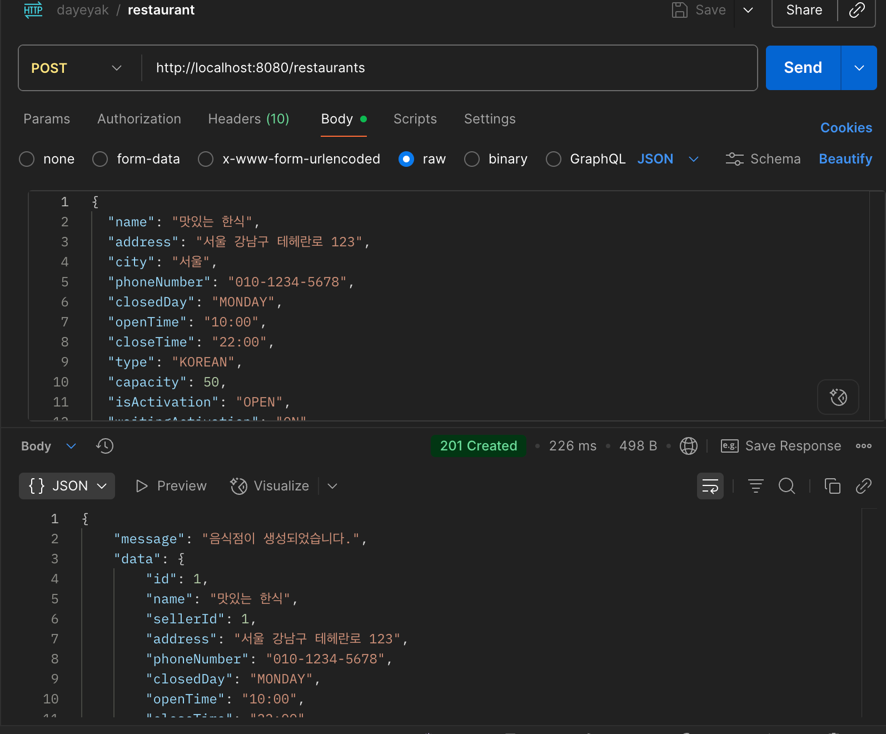
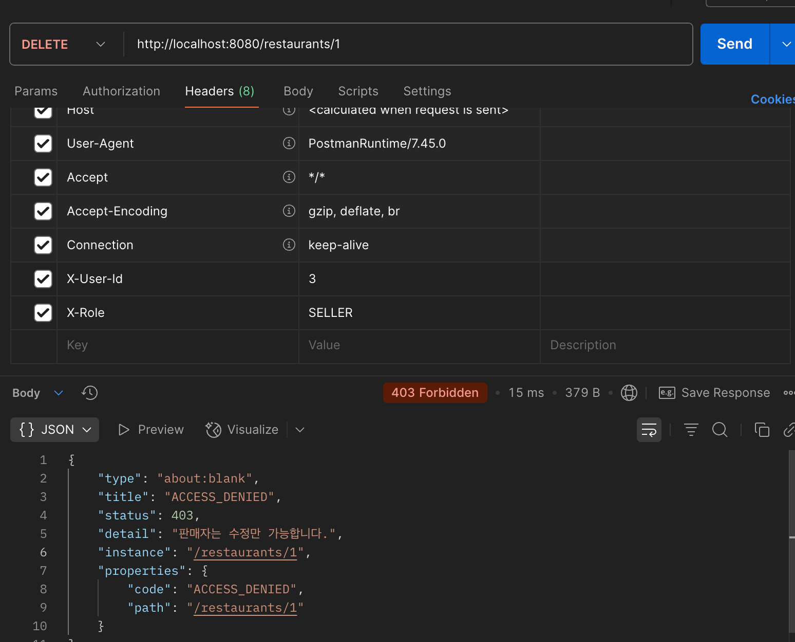

## 📝 요약
음식점 정보 기본 정보를 가진 음식점 테이블을 바탕으로 영업일 테이블과 잔여좌석 테이블을 관리함 

## 💫 구현 및 변경 사항 
1. 음식점 CRUD: 누구나 조회 가능, 판매자는 조회, 생성, 수정, 마스터는 모두 가능
2. 음식점 검색시 가게명, 도시, 음식점 종류에 따라 검색 가능, 오름차순 내림차순 설정 가능
3. 음식점 생성 시 영업일 테이블과 잔여좌석 테이블 30일치가 함께 생성 됨
4. 영업일 테이블은 매일 1개씩 잔여좌석과 함께 생성됨
5. 잔여좌석은 예약된 시간에서 90분 뒤 자동 복구됨(예약 좌석을 따로 기록하여 서버 재시작시에도 안정적으로 구동)

## 📸스크린샷

## ✅ 체크리스트

- [x] 코드 정상 작동 테스트 완료
- [ ] 관련 문서(API 문서, 위키 등) 업데이트
- [x] 팀의 코드 컨벤션/스타일 가이드 준수
- [ ] Reviewers에 팀원 등록

## 💬 TODO 
1. 가게 웨이팅 사용 여부 메서드 미구현
2. 가게 활성 상태 여부 메서드 미구현
